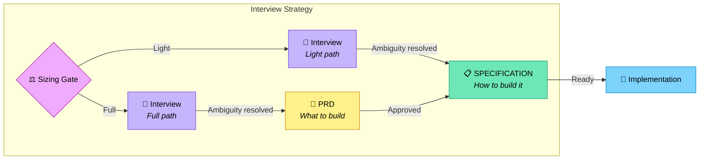

# Interview Strategy

The standard Deft workflow: structured interview → SPECIFICATION. This is the
canonical source of truth for the interview process. All entry points (CLI via
`run spec`, agent via `deft-setup` Phase 3, and `templates/make-spec.md`) MUST
follow this strategy.

Legend (from RFC2119): !=MUST, ~=SHOULD, ≉=SHOULD NOT, ⊗=MUST NOT, ?=MAY.

**⚠️ See also**: [strategies/discuss.md](./discuss.md) | [strategies/yolo.md](./yolo.md) | [core/glossary.md](../core/glossary.md)

## When to Use

- ! Default strategy for all new projects
- ~ Projects with unclear or evolving requirements
- ~ When stakeholder alignment is needed before implementation
- ? Skip to SPECIFICATION phase if requirements are already fully documented

---

## Sizing Gate

Before the interview begins, determine project complexity to select the
appropriate path. The gate runs once, immediately after hearing what the user
wants to build.

! The sizing gate is a **blocking question**. The AI MUST propose a size and
wait for the user to confirm or override before asking any interview questions.
⊗ Combine the sizing proposal with the first interview question in the same message.
⊗ Proceed to interview questions before the user has explicitly confirmed the path.

### Sizing Signals

The AI SHOULD propose a size based on these signals; the user confirms or overrides:

- Number of features (≤5 → Light, >5 → Full)
- Number of components/services (1–2 → Light, 3+ → Full)
- Expected duration (days → Light, weeks/months → Full)
- Team/agent count (solo → Light, multi-agent/swarm → Full)
- Integration complexity (standalone → Light, external APIs/auth/DB → Full)

### PROJECT.md Override

`PROJECT.md` ? declare `**Process**: Light` or `**Process**: Full` to skip the
gate entirely. If the field is absent or empty, the AI MUST ask.

## Workflow Overview



---

## Interview Rules (shared by both paths)

- ~ Use Claude AskInterviewQuestion when available (emulate if not)
- ! Ask **ONE** focused, non-trivial question per step
- ⊗ Ask multiple questions at once or sneak in "also" questions
- ~ Provide numbered answer options when appropriate
- ! Include "other" option for custom/unknown responses
- ! Indicate which option is RECOMMENDED
- ! When done, append all questions asked and answers given to the working document

### Question Areas

- ! Missing decisions (language, framework, deployment)
- ! Edge cases (errors, boundaries, failure modes)
- ! Implementation details (architecture, patterns, libraries)
- ! Requirements (performance, security, scalability)
- ! UX/constraints (users, timeline, compatibility)
- ! Tradeoffs (simplicity vs features, speed vs safety)

### Transition Criteria (interview complete)

- ! All major decisions have answers
- ! Edge cases are addressed
- ! User has approved key tradeoffs (Interview strategy) or Johnbot has chosen recommended options (Yolo strategy)
- ~ Little ambiguity remains

---

## Light Path (small/medium projects)

Interview → SPECIFICATION with embedded Requirements.

### Flow

1. Sizing gate selects Light
2. Interview (rules above)
3. Write `./vbrief/specification.vbrief.json` with `status: draft`
4. Summarize decisions, ask user to review
5. On approval, update `status` to `approved`
6. Run `task spec:render` (or generate `SPECIFICATION.md` directly if task unavailable)

### SPECIFICATION Structure (Light)

```markdown
# [Project Name] SPECIFICATION

## Overview
Brief summary of the project.

## Requirements

### Functional Requirements
- FR-1: [requirement]
- FR-2: [requirement]

### Non-Functional Requirements
- NFR-1: Performance — [requirement]
- NFR-2: Security — [requirement]

## Architecture
High-level system design, components, data flow.

## Implementation Plan

### Phase 1: Foundation
#### Subphase 1.1: Setup
- Task 1.1.1: [description] (traces: FR-1)
  - Dependencies: none
  - Acceptance: [criteria]

#### Subphase 1.2: Core (depends on: 1.1)
- Task 1.2.1: [description] (traces: FR-2, NFR-1)

### Phase 2: Features (depends on: Phase 1)
...

## Testing Strategy
How to verify the implementation meets requirements.

## Deployment
How to ship it.
```

- ! Requirements section MUST appear in SPECIFICATION.md (embedded, no separate PRD)
- ! Each task SHOULD reference which FR/NFR it implements via `(traces: FR-N)`
- ⊗ Create a separate PRD.md on the Light path

---

## Full Path (large/complex projects)

Interview → PRD → SPECIFICATION with traceability.

### Flow

1. Sizing gate selects Full
2. Interview (rules above)
3. Generate `PRD.md` — user approval gate
4. Write `./vbrief/specification.vbrief.json` with `status: draft`
5. Summarize decisions, ask user to review
6. On approval, update `status` to `approved`
7. Run `task spec:render` (or generate `SPECIFICATION.md` directly if task unavailable)

### PRD Structure (Full path only)

```markdown
# [Project Name] PRD

## Problem Statement
What problem does this solve? Who has this problem?

## Goals
- Primary goal
- Secondary goals
- Non-goals (explicitly out of scope)

## User Stories
As a [user type], I want [capability] so that [benefit].

## Requirements

### Functional Requirements
- FR-1: [requirement]
- FR-2: [requirement]

### Non-Functional Requirements
- NFR-1: Performance — [requirement]
- NFR-2: Security — [requirement]

## Success Metrics
How do we know this succeeded?

## Open Questions
Any remaining decisions deferred to implementation.
```

### PRD Guidelines

- ! Focus on WHAT, not HOW
- ! Use RFC 2119 language (MUST, SHOULD, MAY)
- ! Number all requirements for traceability
- ~ Include acceptance criteria for each requirement
- ⊗ Include implementation details or architecture

### PRD Transition Criteria

- ! All functional requirements documented
- ! Non-functional requirements specified
- ! User has reviewed and approved PRD
- ~ No blocking open questions remain

### SPECIFICATION Structure (Full)

```markdown
# [Project Name] SPECIFICATION

## Overview
Brief summary and link to PRD.

## Architecture
High-level system design, components, data flow.

## Implementation Plan

### Phase 1: Foundation
#### Subphase 1.1: Setup
- Task 1.1.1: [description] (traces: FR-1)
  - Dependencies: none
  - Acceptance: [criteria]

#### Subphase 1.2: Core (depends on: 1.1)
- Task 1.2.1: [description] (traces: FR-2, NFR-1)

### Phase 2: Features (depends on: Phase 1)
...

## Testing Strategy
How to verify the implementation meets requirements.

## Deployment
How to ship it.
```

---

## SPECIFICATION Guidelines (both paths)

- ! Reference requirement IDs (FR-1, NFR-2, etc.) in each task
- ! Break into phases, subphases, tasks
- ! Mark ALL dependencies explicitly
- ! Design for parallel work (multiple agents)
- ! End each phase/subphase with tests that pass
- ~ Size tasks for 1-4 hours of work
- ~ Minimize inter-task dependencies
- ⊗ Write code (specification only)

### Task Format

Each task SHOULD include:
- ! Clear description
- ! Dependencies (or "none")
- ! Acceptance criteria
- ~ Estimated effort
- ? Assigned agent (for swarm mode)

### Transition Criteria

- ! All requirements mapped to tasks
- ! Dependencies form a valid DAG (no cycles)
- ! `./vbrief/specification.vbrief.json` status is `approved`
- ! `SPECIFICATION.md` has been rendered via `task spec:render`
- ! Ready for "implement SPECIFICATION.md"

---

## Artifacts Summary

**Light path:**

| Artifact | Purpose | Created By |
|----------|---------|------------|
| `./vbrief/specification.vbrief.json` | Spec source of truth | Interview |
| `SPECIFICATION.md` | Generated plan with embedded Requirements | Rendered |

**Full path:**

| Artifact | Purpose | Created By |
|----------|---------|------------|
| `PRD.md` | What to build (approval gate) | Interview |
| `./vbrief/specification.vbrief.json` | Spec source of truth | Post-PRD |
| `SPECIFICATION.md` | Generated implementation plan | Rendered |

## Invoking This Strategy

```
/deft:run:interview [project name]
```

Or explicitly:

```
Use the interview strategy to plan [project].
```

After completion:

```
implement SPECIFICATION.md
```
