# SpecKit Strategy

A five-phase spec-driven development workflow inspired by [GitHub's spec-kit](https://github.com/github/spec-kit).

Legend (from RFC2119): !=MUST, ~=SHOULD, ≉=SHOULD NOT, ⊗=MUST NOT, ?=MAY.

## When to Use

- ~ Large or complex projects with multiple contributors
- ~ Projects requiring formal specification review
- ~ When parallel agent development is planned
- ~ Enterprise environments with compliance requirements
- ? Skip Phase 1 if project.md Principles already defined

## Workflow Overview

```mermaid
flowchart LR
    subgraph speckit ["SpecKit Strategy"]
        P["📜 Principles<br/><i>project.md</i>"]
        S["📝 Specify<br/><i>WHAT/WHY</i>"]
        PL["🏗️ Plan<br/><i>HOW</i>"]
        T["✅ Tasks<br/><i>Executable list</i>"]
        I["🔨 Implement<br/><i>Execute</i>"]
    end

    P -->|"Established"| S
    S -->|"Approved"| PL
    PL -->|"Reviewed"| T
    T -->|"Ready"| I

    style P fill:#c4b5fd,stroke:#7c3aed,color:#000
    style S fill:#fef08a,stroke:#ca8a04,color:#000
    style PL fill:#6ee7b7,stroke:#059669,color:#000
    style T fill:#7dd3fc,stroke:#0284c7,color:#000
    style I fill:#f0abfc,stroke:#a855f7,color:#000
```



---

## Phase 1: Principles

**Goal:** Establish immutable project principles before any specification.

**Output:** `project.md` with populated Principles section

### Process

- ! Define 3-5 non-negotiable principles
- ! Include at least one anti-principle (⊗)
- ~ Interview stakeholders about architectural constraints
- ⊗ Proceed without defined principles

### Transition Criteria

- ! Principles section in project.md is complete
- ! All stakeholders have reviewed principles
- ~ No `[NEEDS CLARIFICATION]` markers remain

---

## Phase 2: Specify (WHAT/WHY)

**Goal:** Document WHAT to build and WHY, without implementation details.

**Output:** `specs/[feature]/spec.md`

### Specification Structure

```markdown
# Feature Specification: [Name]

**Feature Branch**: `###-feature-name`
**Status**: Draft | Review | Approved

## User Scenarios (mandatory)

### User Story 1 - [Title] (Priority: P1)
[Journey description]

**Why this priority**: [Value explanation]
**Independent Test**: [How to test in isolation]

**Acceptance Scenarios**:
1. **Given** [state], **When** [action], **Then** [outcome]

### Edge Cases
- What happens when [boundary]?
- How does system handle [error]?

## Requirements (mandatory)

### Functional Requirements
- **FR-001**: System MUST [capability]
- **FR-002**: System MUST [capability] [NEEDS CLARIFICATION: detail?]

### Non-Functional Requirements
- **NFR-001**: Performance — [requirement]
- **NFR-002**: Security — [requirement]

## Success Criteria (mandatory)
- **SC-001**: [Measurable outcome]
```

### Guidelines

- ! Focus on WHAT users need and WHY
- ! Use `[NEEDS CLARIFICATION: question]` for any ambiguity
- ! Number all requirements (FR-001, NFR-001) for traceability
- ! Prioritize user stories (P1, P2, P3)
- ⊗ Include HOW to implement (no tech stack, APIs, code)
- ⊗ Guess when uncertain — mark it instead

### Transition Criteria

- ! No `[NEEDS CLARIFICATION]` markers remain
- ! All user stories have acceptance scenarios
- ! Requirements are testable and unambiguous
- ! Stakeholders have approved specification

---

## Phase 3: Plan (HOW)

**Goal:** Document HOW to build it with technical decisions.

**Input:** Approved `spec.md`

**Output:** `specs/[feature]/plan.md` + supporting documents

### Plan Structure

```markdown
# Implementation Plan: [Feature]

**Spec**: [link to spec.md]
**Status**: Draft | Review | Approved

## Pre-Implementation Gates

### Simplicity Gate
- [ ] Using ≤3 packages/projects?
- [ ] No future-proofing without justification?

### Test-First Gate
- [ ] Contract tests defined?
- [ ] Acceptance tests mapped to user stories?

## Architecture

### Components
[High-level system design]

### Data Model
[Key entities and relationships]

### API Contracts
[Endpoints, events, interfaces]

## Implementation Phases

### Phase 1: Foundation
- Dependencies: none
- Deliverables: [list]

### Phase 2: Core (depends on: Phase 1)
- Dependencies: Phase 1 complete
- Deliverables: [list]

## Technology Decisions

| Decision | Choice | Rationale |
|----------|--------|-----------|
| Language | [X] | [Why] |
| Framework | [X] | [Why] |
```

### Supporting Documents

- ? `specs/[feature]/data-model.md` — detailed schemas
- ? `specs/[feature]/contracts/` — API specifications
- ? `specs/[feature]/research.md` — technology research

### Guidelines

- ! Reference spec requirements (FR-001, etc.)
- ! Document rationale for every technology choice
- ! Pass all pre-implementation gates before proceeding
- ~ Keep plan.md high-level; extract details to supporting docs
- ⊗ Write implementation code

### Transition Criteria

- ! All gates pass (or exceptions documented)
- ! Every spec requirement maps to a plan element
- ! Architecture reviewed and approved

---

## Phase 4: Tasks

**Goal:** Generate an executable task list from the plan.

**Input:** Approved `plan.md` + supporting documents

**Output:** `specs/[feature]/tasks.md`

### Task Structure

```markdown
# Tasks: [Feature]

**Plan**: [link to plan.md]
**Generated**: [date]

## Task Legend
- `[P]` = Parallelizable (no dependencies)
- `[S]` = Sequential (has dependencies)
- `[B]` = Blocked (waiting on external)

## Parallel Group 1: Setup
- [P] Task 1.1: Initialize project structure
- [P] Task 1.2: Configure CI/CD pipeline
- [P] Task 1.3: Set up development environment

## Parallel Group 2: Contracts (depends on: Group 1)
- [P] Task 2.1: Define API contracts
- [P] Task 2.2: Write contract tests
- [P] Task 2.3: Create data model schemas

## Sequential: Core Implementation (depends on: Group 2)
- [S] Task 3.1: Implement data layer (depends on: 2.3)
- [S] Task 3.2: Implement business logic (depends on: 3.1)
- [S] Task 3.3: Implement API endpoints (depends on: 2.1, 3.2)

## Task Template
### Task X.Y: [Title]
- **Depends on**: [task IDs or "none"]
- **Acceptance**: [criteria from spec]
- **Effort**: [S/M/L or hours]
- **Agent**: [optional assignment]
```

### Guidelines

- ! Derive tasks from plan phases and deliverables
- ! Mark parallelizable tasks with `[P]`
- ! Reference acceptance criteria from spec
- ~ Size tasks for 1-4 hours of work
- ~ Group independent tasks for parallel execution
- ⊗ Create tasks not traceable to plan

### Transition Criteria

- ! All plan deliverables have corresponding tasks
- ! Dependencies form a valid DAG (no cycles)
- ! Parallel groups identified and marked

---

## Phase 5: Implement

**Goal:** Execute tasks following test-first discipline.

**Input:** Approved `tasks.md`

### Process

- ! Write tests BEFORE implementation (Red)
- ! Implement minimal code to pass tests (Green)
- ! Refactor while keeping tests green (Refactor)
- ! Mark tasks complete as they pass acceptance
- ~ Work on `[P]` tasks in parallel when possible

### File Creation Order

1. Create contract/API specifications
2. Create test files (contract → integration → unit)
3. Create source files to make tests pass
4. Refactor and document

### Guidelines

- ! Follow project.md Principles throughout
- ! Update tasks.md status as work progresses
- ⊗ Implement without failing tests first
- ⊗ Skip refactoring phase

---

## Artifacts Summary

| Phase | Artifact | Purpose |
|-------|----------|---------|
| 1. Principles | project.md | Governing rules |
| 2. Specify | spec.md | WHAT/WHY |
| 3. Plan | plan.md + docs | HOW |
| 4. Tasks | tasks.md | Executable list |
| 5. Implement | Code + tests | Working software |

## Directory Structure

```
project/
├── project.md              # Principles + config
├── specs/
│   └── 001-feature-name/
│       ├── spec.md         # Phase 2
│       ├── plan.md         # Phase 3
│       ├── tasks.md        # Phase 4
│       ├── data-model.md   # Phase 3 supporting
│       ├── research.md     # Phase 3 supporting
│       └── contracts/      # Phase 3 supporting
└── src/                    # Phase 5
```

## Invoking This Strategy

Set in project.md:
```markdown
**Strategy**: [strategies/speckit.md](./deft/strategies/speckit.md)
```

Or explicitly:
```
Use the speckit strategy for this project.
```

Start with:
```
I want to build [project] with features:
1. [feature]
2. [feature]
```
